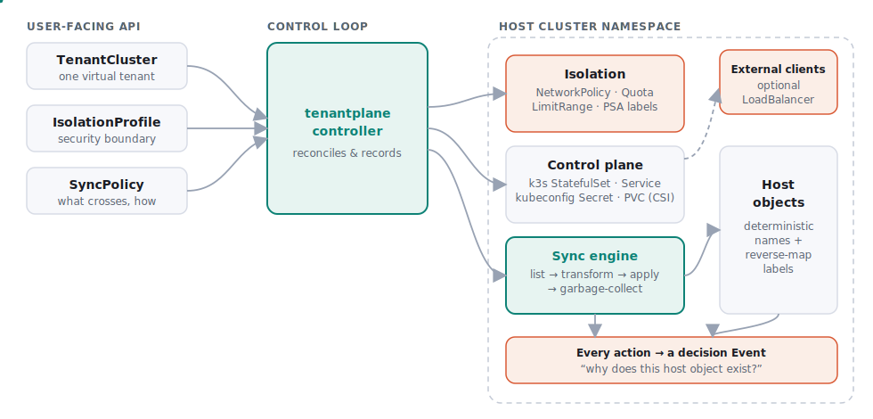
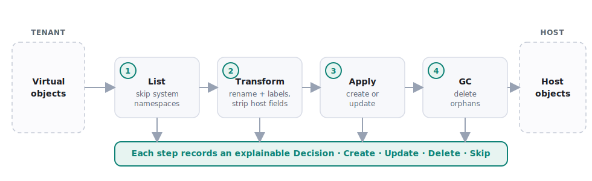

<div align="center">


<h1>tenantplane</h1>

**Virtual Kubernetes tenants you can actually explain.**

Deterministic sync · Explicit isolation · Transparent day-2 operations

[](LICENSE)
[](go.mod)
[](#project-status)
[](CONTRIBUTING.md)

[Documentation](#documentation) · [Quickstart](#quickstart) · [Concepts](#core-resources) · [Roadmap](#roadmap) · [Contributing](CONTRIBUTING.md)

</div>

---

**tenantplane** is an open source virtual Kubernetes tenant platform for platform
engineering teams that need secure, transparent, and scalable multi-tenancy.

It provides a lightweight, inspectable control plane for managing virtual
Kubernetes tenants while keeping **synchronization**, **isolation**, and
**operations** predictable and explainable. Each tenant runs its own small
control plane inside a host namespace; tenantplane reconciles it, enforces an
explicit isolation boundary, and deterministically maps tenant resources onto the
host — recording a decision for every action so you can always ask *why* a host
object exists.

> [!NOTE]
> **Project status: early development.** The controller today provisions a
> shared-mode control plane, applies isolation, extracts a tenant kubeconfig, and
> performs host-ward resource sync with decisions surfaced as Kubernetes Events.
> APIs are pre-1.0 and may change. See the [Roadmap](#roadmap).

## Why tenantplane

As Kubernetes adoption grows, platform teams need multi-tenancy that is easy to
operate, secure by design, and flexible across workloads and isolation
requirements. tenantplane is built for teams that value transparency and
predictability — you should always be able to answer:

- Why was a resource synchronized, and which policy decided it?
- What changes will occur before they are applied?
- Which isolation boundary applies to this tenant, and what does it enforce?
- How can a tenant safely migrate between isolation models?

## Features

| | |
| --- | --- |
| 🔍 **Explainable sync** | Deterministic virtual-to-host mapping with offline dry-run planning (`explain-sync`) and a decision record per action. |
| 🛡️ **Explicit isolation** | Isolation profiles compose NetworkPolicy, ResourceQuota, LimitRange, and Pod Security into one auditable boundary. |
| 🪶 **Lightweight control planes** | Each tenant runs a small [k3s](https://k3s.io) control plane in a host namespace — easy to understand, audit, and extend. |
| 🔁 **Day-2 by design** | Reconciliation, drift correction, and orphan garbage collection built for the operational realities of multi-tenancy. |
| 🧭 **Migration paths** | Designed to evolve tenants across shared, dedicated, and private isolation models without recreating tenant API state. |
| 📈 **Observable** | Sync decisions as Kubernetes Events today; OpenTelemetry and Prometheus on the roadmap. |
| ☁️ **Runs anywhere** | Any conformant Kubernetes — kind for local work, with dedicated guides for [AWS EKS](website/content/docs/guides/deploy-eks.md), [Azure AKS](website/content/docs/guides/deploy-aks.md), and [Google GKE](website/content/docs/guides/deploy-gke.md). |

## Architecture



A single controller-runtime manager watches the tenantplane custom resources on
the host cluster. For each `TenantCluster` it drives the full lifecycle:

1. Compiles the referenced **IsolationProfile** into a default-deny NetworkPolicy,
   ResourceQuota, LimitRange, and Pod Security Admission labels.
2. Reconciles a **control plane** — a k3s StatefulSet fronted by a headless
   Service — and extracts its kubeconfig into a Secret.
3. Runs the **sync engine**, which maps every tenant resource declared in the
   **SyncPolicy** to a deterministically named host object and garbage-collects
   orphans.

Every host object is named `<resource>-x-<virtual-namespace>-x-<tenant>` (hashed
when that would exceed a DNS label) and carries reverse-mapping labels and
annotations, so any host object traces back to the tenant object that caused it.

For each resource kind the SyncPolicy marks `toHost`, the sync engine runs the
same four deterministic steps — recording a decision at each one:



Read more in the [architecture docs](website/content/docs/architecture.md).

## Quickstart

Bring up a shared-mode tenant on a local [kind](https://kind.sigs.k8s.io) cluster:

```bash
# 1. Cluster + CRDs
kind create cluster --name tenantplane-dev
kubectl apply -f config/crd

# 2. Build, load, and deploy the controller
make kind-load
make deploy
kubectl -n tenantplane-system rollout status deploy/tenantplane-controller

# 3. Apply the samples and watch the tenant come up
kubectl apply -f config/samples/isolationprofile_restricted.yaml
kubectl apply -f config/samples/syncpolicy_default.yaml
kubectl apply -f config/samples/tenantcluster_dev.yaml
kubectl get tenantcluster dev -w
```

Predict where a tenant resource will land — before applying anything:

```bash
go build ./cmd/tenantplane
./tenantplane explain-sync --tenant dev --tenant-namespace team-dev \
  --virtual-namespace default --kind Pod --name nginx
```

Full walkthrough: [Quickstart guide](website/content/docs/quickstart.md).
Deploying to a managed cloud? See the
[EKS](website/content/docs/guides/deploy-eks.md) ·
[AKS](website/content/docs/guides/deploy-aks.md) ·
[GKE](website/content/docs/guides/deploy-gke.md) guides — they cover storage
classes, network-policy enforcement, registry setup, and load-balancer exposure
per cloud.

## Core resources

tenantplane has a deliberately small surface — three custom resources in the
`tenantplane.io/v1alpha1` API group:

| Resource | Purpose |
| --- | --- |
| [**TenantCluster**](website/content/docs/concepts/tenantcluster.md) | The lifecycle of one virtual tenant (shared, dedicated, or private). |
| [**IsolationProfile**](website/content/docs/concepts/isolationprofile.md) | The security and fairness boundary applied around a tenant. |
| [**SyncPolicy**](website/content/docs/concepts/syncpolicy.md) | Which resources cross the virtual-to-host boundary, and how conflicts resolve. |

## Documentation

Full documentation — concepts, guides, and reference — lives in [`website/`](website/)
and builds into a static site with [Hugo](https://gohugo.io):

```bash
make site-serve      # live docs at http://localhost:1313
```

Start with the [Introduction](website/content/docs/introduction.md) and
[Quickstart](website/content/docs/quickstart.md). See
[`website/README.md`](website/README.md) for how to build and edit the site.

## Roadmap

**Available now:** three CRDs · shared-mode k3s control planes · isolation
enforcement · kubeconfig extraction · deterministic host-ward (`toHost`) sync ·
decision Events · CLI with `explain-sync`.

**Next:** bidirectional sync with conflict policy · durable SyncDecision records ·
expanded isolation enforcement · Kubernetes-version→image mapping.

**Later:** OpenTelemetry & Prometheus · `dedicated`/`private` modes · migration
workflows · GitOps · high-density ephemeral tenants.

See the [full roadmap](website/content/docs/roadmap.md).

## Building from source

```bash
make build     # build the CLI
make test      # run unit tests
make verify    # fmt + test + build
```

Requires Go 1.22+. The controller image is built with `make manager-image`.

## Contributing

Contributions are welcome — Kubernetes controllers, networking, security,
observability, documentation, and testing all have room to grow. Please read
[CONTRIBUTING.md](CONTRIBUTING.md), then open an issue or pull request.

## License

Licensed under the [Apache License 2.0](LICENSE).
